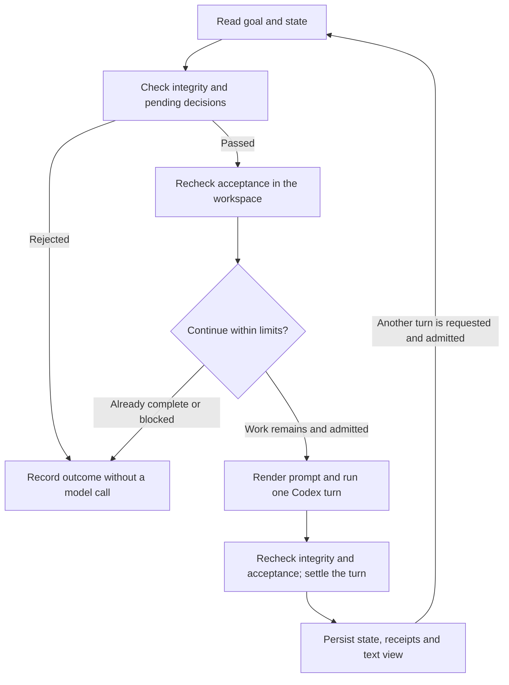

# Why Codex Goal Kernel is designed this way

[中文](design.zh-CN.md) · [Usage](../README.md)

## 1. The outcome we want

The goal is to help Codex sustain useful work toward the same accepted outcome
across multiple turns. Longer wall-clock time, more tokens and a larger todo
list are insufficient measures of success. A useful run must preserve its
objective, notice when earlier work stops being valid, and stop honestly when
it cannot continue within its constraints.

Our working hypothesis is that a small outer loop with durable state and
explicit checks can make continuation easier to inspect and constrain. This is
a design hypothesis, not proof that the runner outperforms native Codex or
eliminates drift. The current implementation drives `codex exec` and
`codex exec resume`; it does not extend Codex's native Goal API.

## 2. Why one goal and one execution provider

A goal has an objective, acceptance checks and a turn policy. The kernel owns
admission, progress accounting and completion. Codex owns the workspace actions
needed to satisfy the goal. The operator supplies the acceptance contract and
resolves decisions reserved for them.

This division keeps the next policy change local: acceptance belongs in
[`verify.ts`](../src/verify.ts), state mutation in
[`state.ts`](../src/state.ts), and admission and settlement in
[`kernel.ts`](../src/kernel.ts). The text renderer does not decide whether work
is complete. TypeScript keeps these rules and their state vocabulary in the
same language as the CLI and adapter, with a separate strict typecheck; types
alone do not validate data arriving from disk or subprocesses.

The repository is independent, with its own dependencies, CLI, tests and state
directory. It requires no parent framework or shared authority service. Starting
with one provider lets us examine the usefulness of the loop before introducing
multiple host protocols, a capability catalog or multi-agent coordination.

## 3. The loop and its ordering

A failed integrity or owner gate stops before the model call. After an admitted
turn, integrity and pending decisions still take precedence. With those gates
satisfied, full acceptance wins over a just-reached turn or idle limit. Otherwise
the exhausted limit stops the run.

This order matters: a goal completed on its last permitted turn should succeed;
a goal with a changed declaration should not succeed merely because its old
checks pass. A runtime failure consumes an attempted turn and records a stop.
It is not an invitation to retry indefinitely.

## 4. Why recheck acceptance instead of accumulating passes

Suppose turn one creates file A and passes its check. Turn two creates file B
but deletes A. Keeping a permanent union of passed checks would report both A
and B as complete even though they no longer coexist.

Automatic checks therefore run before an action and again after a successful
action whose integrity checks pass. The next prompt sees current acceptance;
a failed check revokes its earlier pass and reopens todos completed by that
condition. The model's `closed` list is a claim to cross-check, not the source
of truth. Actual passing work can be recognized even if the model omits a claim.

The cost is repeated verification. This first implementation favors transparent
behavior over a dependency graph or invalidation cache. Checks should be cheap,
bounded, repeatable and read-only. Dependency-based verification would be worth
adding only after measured check cost justifies it and tests prove that relevant
changes cannot escape revalidation.

`owner` checks are different: they retain explicit operator acceptance and are
not automatically re-judged. Their suitability and continued validity require
operator judgment. All verification remains only as strong as the declared
checks: file existence does not establish quality, and a command's
`expect_stdout` currently tests substring containment, not exact output equality.

## 5. Why current acceptance and progress history are separate

Two questions need different answers:

| State | Question | Behavior |
| --- | --- | --- |
| `verified_predicates` | Which acceptance conditions hold at the latest check? | Passes can be added or revoked. |
| `credited_predicates` | Which checkpoints have already earned progress credit? | A checkpoint earns credit once for this goal. |

Repeatedly reporting the same passing condition cannot keep a run alive. Neither
can creating new todos or cycling through break-and-repair of the same artifact.
A newly verified, previously uncredited checkpoint resets the idle streak.
Repairing earlier work restores acceptance but earns no additional credit.

This deliberately conservative progress measure has a cost: valuable research,
refactoring or repair may take several turns without passing a new checkpoint.
Choose meaningful intermediate acceptance conditions and an appropriate
`max_idle_turns`. The kernel does not measure all useful reasoning or guarantee
that its idle cutoff is optimal for every task. One-shot acceptance conditions
also need care: automatic predicates are expected to be safely re-evaluated,
not to repeat an external side effect.

## 6. Why freeze the goal and render the prompt deterministically

The goal fingerprint covers the objective, acceptance predicates and policy.
Comparing it with the current declaration catches mismatched edits, including
edits made during a turn. A proposed objective amendment stops execution until
an explicit `amend --confirm` or `amend --reject` operation. The present amendment
command changes only objective text; predicate or budget changes require a new
goal. It is not a complete versioned amendment or audit system.

[`renderContext`](../src/context.ts) rebuilds the explicit prompt from the goal
and state in a stable order. This makes the objective, remaining work, assumptions
and limits consistently visible. It reduces ambiguity in what the kernel
supplied; it does not make model behavior deterministic. Session history,
workspace contents, external inputs and context compaction are separate. A
`ctx_hash` alone cannot reproduce a historical turn.

A todo's `advances` field must name a declared predicate. That checks the
reference, not the semantic relevance of the work. File assumptions detect a
change in a declared source revision, not whether an undeclared belief is true.
These constraints address specific failure modes; they cannot certify alignment
with the user's full intent.

## 7. Why a few local files and a CLI adapter

Each goal lives under `.goal-kernel/goals/<id>/`:

| Artifact | Role |
| --- | --- |
| `goal/1.0.0.json` | Current objective, acceptance checks and policy. |
| `state.json` | Continuation state, session id, counters, acceptance and decisions. |
| `journal.jsonl` | Records of turns, checks and stops for inspection. |
| `VIEW.md` | A text projection of recorded state and recent receipts. |

This keeps the single-writer experiment easy to inspect and copy. A fresh kernel
process can read its saved state and request continuation of the recorded Codex
session. If the provider no longer has that thread, the kernel discards the
binding and carries the same rendered turn on a new thread, once, because the
prompt is rebuilt from state rather than from the thread. What is lost in that
case is only the model's hidden working memory. Under `fresh` continuity nothing
is ever resumed, so the question does not arise. State files still do not
replace the provider's conversation history; they decide what the loop does
when that history is unavailable.

The adapter uses JSON events and a structured final response from the existing
CLI. This gives the kernel a concrete execution path with a small integration
surface. A subprocess per turn costs startup time and offers limited interruption
control; a direct service protocol would need evidence that these limitations
matter before adding another lifecycle to maintain.

Atomic replacement protects individual JSON writes. There is no transaction
across journal and state, no concurrency lock, and no authenticated or tamper-proof
log. The persisted representation supports ordinary continuation, not arbitrary
crash recovery or complete replay. `status` and `view` show the last recorded
snapshot. Calling `run` on a completed goal rechecks it without another model
call; regression produces a stop rather than automatically reopening execution.

## 8. Why scheduling and broader orchestration stay outside

`run --turns N` performs bounded work when explicitly invoked. An external caller
may schedule it, but must serialize invocations for a goal. The kernel provides
no concurrency fence.

| Deferred mechanism | Reason for keeping it outside the current kernel |
| --- | --- |
| Built-in clock, daemon and automatic retries | Require lifecycle, overlap and recovery policies beyond deciding one turn. |
| Multiple execution providers and peer agents | Add coordination and authority questions before the single-provider benefit is established. |
| A second model judging drift every turn | Adds cost and another fallible judgment; machine checks are easier to reproduce for the conditions they can express. |
| A general memory service or dashboard | Adds integration and projection work without yet demonstrating better accepted outcomes. |

These boundaries reduce implementation and evaluation scope. They leave real
limitations: a stopped goal has no general recovery command, and the caller
must handle scheduling and operational repair. There is a total turn limit and
a consecutive-idle limit; token and wall-clock ceilings are optional, and the
clock starts at the first admitted model call rather than at `init`, so an
idle goal does not age. Reported provider usage is observational and its
cumulative-versus-delta semantics still need qualification, which is why the
token ceiling is described as able to fire early but never late.

## 9. Where continuity lives, and why that is a measured condition

Memory between turns can live in the provider's thread or in the kernel's
state. The first version of this kernel chose the thread: every turn resumed
the same Codex session. LoopX's published LHTB arm made the opposite choice,
one fresh `codex exec` per heartbeat and never a resume, with the stated aim
that the next wake starts from recorded state rather than stale chat memory.
Neither project has shown which choice produces more accepted work over a long
run, and this repository should not pretend otherwise.

So `policy.continuity` is a frozen per-goal condition with two values. Under
`resume` the model keeps its hidden working memory; under `fresh` the rendered
state and the workspace are the only memory. Three decisions make the two arms
comparable:

| Decision | Reason |
| --- | --- |
| Both modes render identical prompt sections except the opening line. | A comparison should vary one thing: the hidden thread history. |
| Every prompt carries a bounded tail of the last five turns, in both modes. | A fresh thread needs to know what was tried; giving it only to `fresh` would confound the comparison, and an unbounded narrative would reintroduce prose-driven drift. |
| Lost-thread recovery exists regardless of mode. | A `resume` goal should not die because the provider forgot a thread when the kernel can rebuild the turn from state. Recovery is bounded to one fresh retry per turn and recorded in the receipt. |

The ablation runner in [`examples/ablation.ts`](../examples/ablation.ts) runs
one task under matched model, sandbox and turn budget across the two kernel
modes and two native baselines, and judges every arm with the same independent
checks. It reports completion, turns, idle turns, regressions of previously
passing checks, recoveries and reported tokens. It also states its own
unfairness: native arms stop early when the independent checks pass, which is
an oracle the model does not see. Small samples on the bundled toy tasks
validate the pipeline; they do not answer the question. Real tasks, repeated
runs and reported uncertainty would.

## 10. What would justify stronger claims

The [reliability tests](../tests/reliability.test.ts) cover stale acceptance,
repeated credit, restart behavior, goal edits and terminal precedence; the
[continuity tests](../tests/continuity.test.ts) cover lost-thread
classification and bounded recovery, `fresh` mode and the bounded recent-turn
tail; the [budget tests](../tests/budget.test.ts) cover the optional token and
wall-clock ceilings. The [live smoke](../examples/live-smoke.ts) exercises five
separate kernel processes on one Codex session, external regression and repair,
a lost thread recovered on a new thread, last-turn completion, and rejection of
stale success. It deliberately requests one checkpoint per turn to exercise
continuation; it is not a realistic long-task benchmark.

The intended trust model is a cooperative local operator and agent. An agent
with workspace write access can also affect state or checker files. Owner CLI
operations are not authenticated human-only actions, and command checks run
with the kernel process's permissions rather than the model sandbox. A goal hash
is a consistency check, not a security boundary.

To establish practical value, compare native and kernel runs on matched real
tasks, with a pinned model, permissions, acceptance contract and comparable
resource limits. Repeat runs and report independent final acceptance, lost
work, idle spend, recovery, owner interventions and cost with uncertainty.
Qualify provider accounting before making cost claims. Any evaluation involving
multi-hour operation should include interruption and context-pressure cases.
Additional mechanisms should follow a demonstrated failure or measurable gain;
currently neither longer unattended reliability nor reduced semantic drift has
been established by such a comparison.
