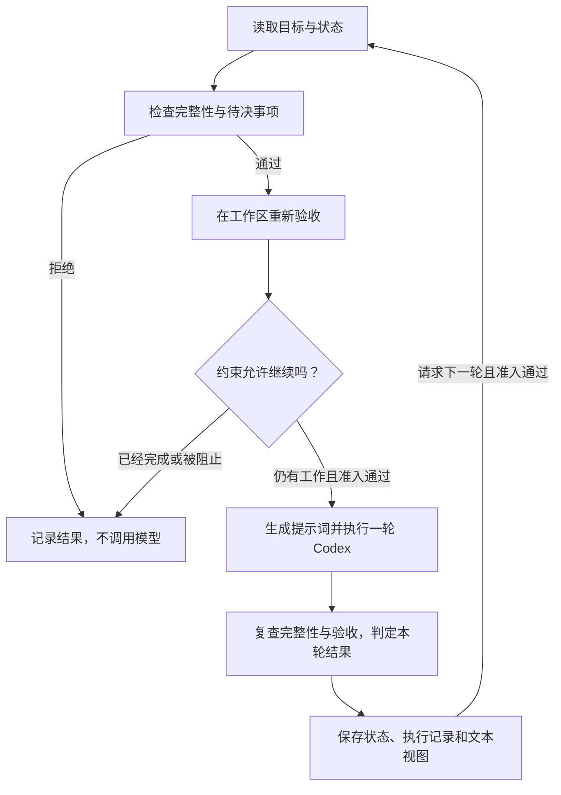

# 为什么 Codex Goal Kernel 这样设计

[English](design.md) · [使用说明](../README.zh-CN.md)

## 1. 希望得到什么结果

目标是让 Codex 跨越多个执行轮次，持续推进同一个被认可的结果。运行时间更长、
消耗更多 token、待办列表更大，都不足以证明成功。一次有价值的运行应当保留原始
目标，发现先前成果何时失效，并在无法遵守约束继续工作时如实停止。

我们的设计假设是：一个具有持久状态和明确检查的小型外部循环，可以让续跑更容易
检查和约束。这是设计假设，不是优于原生 Codex 或消除偏移的证明。当前实现调用
`codex exec` 和 `codex exec resume`，没有扩展 Codex 原生的 Goal API。

## 2. 为什么只围绕一个目标和一个执行方

一个目标包含目标描述、验收检查和轮次策略。内核负责决定能否执行、如何计算进度、
何时完成；Codex 负责改变工作区以满足目标；使用者提供验收约定，并处理明确保留给
自己的决定。

这种分工让下一次规则修改有清晰归属：验收放在
[`verify.ts`](../src/verify.ts)，状态修改放在
[`state.ts`](../src/state.ts)，执行准入和结束判定放在
[`kernel.ts`](../src/kernel.ts)。文本展示不负责判断任务是否完成。
TypeScript 让这些规则、状态词表、CLI 和适配器使用同一种语言，并接受独立的严格
类型检查；类型本身不能代替对磁盘或子进程输入的运行时校验。

项目拥有独立仓库、依赖、CLI、测试和状态目录，不要求安装上层框架或共享状态服务。
先支持一个执行方，有利于先判断这个循环本身是否有用，再考虑多种宿主协议、能力
目录和多智能体协作。

## 3. 循环为什么采用这个顺序

完整性检查或待决事项不通过时，在调用模型之前停止。执行一轮之后，这些条件仍然
具有优先级；条件满足时，全部验收通过优先于刚刚达到的总轮次或空转上限。否则，
达到上限就停止。

顺序决定了实际行为：在最后一个允许的轮次完成，应当算成功；目标声明发生变化时，
即使旧检查仍然通过，也不能直接算成功。运行错误会消耗一次尝试轮次并记录停止，
不会因此获得无限重试的机会。

## 4. 为什么每轮复验，而不永久累计通过项

假设第一轮创建文件 A 并验收通过；第二轮创建文件 B，却删除了 A。如果只保存历史
通过项的并集，系统会认为 A 和 B 都已完成，尽管它们已经不再同时存在。

因此，自动检查在执行前运行，并在执行成功且完整性检查通过后再次运行。下一轮
提示词看到的是当前验收状态；检查失败会撤销以前的通过结果，并重新打开由该条件
关闭的待办。模型返回的 `closed` 列表只是待核对的声明，不是事实来源；即使模型
漏报，实际通过检查的成果也可以被识别。

代价是重复验证。第一版优先选择容易理解的行为，没有引入依赖图或失效缓存。检查
应该便宜、有超时边界、可重复执行，并且只读。只有测量证明检查成本值得优化，且
测试能证明相关变化不会漏过复验时，才适合增加按依赖选择检查的机制。

`owner` 类型有所不同：它保留明确的使用者验收，不会自动重新裁决，其适用性和
持续有效性需要使用者判断。验收能力始终取决于检查本身：文件存在不能证明质量；
命令检查的 `expect_stdout` 当前判断的是包含指定字符串，而不是输出完全相等。

## 5. 为什么分开保存当前验收和历史进度

两个不同问题需要不同的状态：

| 状态 | 回答的问题 | 变化方式 |
| --- | --- | --- |
| `verified_predicates` | 最近一次检查中，哪些验收条件成立？ | 可以新增，也可以撤销。 |
| `credited_predicates` | 哪些检查点已经计入过进度？ | 同一目标中的一个检查点只计一次。 |

反复报告同一个通过项，不能让任务一直运行；新增待办或反复破坏、修复同一个成果，
也不能做到这一点。首次通过、尚未计入过进度的检查点会清零空转计数。修复旧成果
可以恢复验收，但不再获得一次新的进度计数。

这是一个刻意保守的指标，也有代价：有价值的研究、重构或修复，可能经过多轮才有
新的检查点通过。需要设计有意义的中间验收条件，并设置合适的 `max_idle_turns`。
内核不能衡量所有有价值的思考，也不能保证一个空转阈值适合所有任务。一次性事件
也需要谨慎定义：自动验收条件应当能安全地反复检查，不能通过重复执行外部操作来
证明已经完成。

## 6. 为什么固定目标，并确定性地生成提示词

目标指纹覆盖目标描述、验收条件和策略。将它与当前声明比较，可以发现不一致的
修改，包括发生在执行期间的修改。模型提出目标修订后，运行会停止，等待明确的
`amend --confirm` 或 `amend --reject` 操作。当前修订命令只修改目标文本；调整验收
条件或预算需要创建新目标。它还不是完整的版本化修订或审计系统。

[`renderContext`](../src/context.ts) 按稳定顺序从目标和状态生成明确的提示词，使
目标、剩余工作、假设和限制持续可见。这减少了“内核究竟传入了什么”的歧义，但
不会让模型行为变成确定性的。会话历史、工作区内容、外部输入和上下文压缩都是
另外的输入；仅凭 `ctx_hash` 无法重现过去某一轮执行。

待办的 `advances` 字段必须引用一个已声明的验收条件。这只能检查引用是否有效，
不能检查工作在语义上是否相关。文件假设只能检测已声明来源的版本变化，不能判断
未声明的信念是否正确。这些约束针对具体失败模式，不能认证执行始终符合用户的
完整意图。

## 7. 为什么使用少量本地文件和 CLI 适配器

每个目标保存在 `.goal-kernel/goals/<id>/`：

| 文件 | 职责 |
| --- | --- |
| `goal/1.0.0.json` | 当前目标描述、验收检查和策略。 |
| `state.json` | 续跑状态、会话标识、计数器、验收状态和待决事项。 |
| `journal.jsonl` | 用于检查的轮次、验收和停止记录。 |
| `VIEW.md` | 已记录状态和近期执行记录的文本投影。 |

这让单写入者实验容易检查和复制。一个新的内核进程可以读取已保存的状态，请求
继续之前记录的 Codex 会话。如果执行方已经不再持有该线程，内核会丢弃绑定，把同一份
渲染好的轮次在新线程上重新执行一次，因为提示词是从状态而不是从线程重建的；此时
丢失的只有模型隐藏的工作记忆。在 `fresh` 模式下从不 resume，这个问题不会出现。
状态文件仍然不能替代执行方自己的对话历史，但它决定了在那段历史不可用时循环该怎么做。

适配器读取现有 CLI 的 JSON 事件和结构化最终回复，以较小的集成范围获得真实执行
路径。每轮启动一个子进程有启动成本，中断控制也有限。只有这些限制被证明影响
实际任务时，才值得增加直接服务协议及其需要维护的生命周期。

原子替换保护单个 JSON 文件的写入，但执行记录和状态之间没有事务，没有并发锁，
也没有经过身份认证或防篡改的日志。现有持久化支持普通续跑，不代表任意崩溃恢复
或完整重放。`status` 和 `view` 显示最近记录的快照；对已完成目标调用 `run` 会
重新检查而不调用模型，发现成果失效就停止，不自动重新开始执行。

## 8. 为什么把调度和更大范围的编排留在外部

`run --turns N` 在被明确调用时执行有限轮次。外部调用方可以安排执行时间，但必须
保证同一目标的调用串行进行；内核没有并发隔离机制。

| 暂未加入的机制 | 当前留在内核之外的原因 |
| --- | --- |
| 内置时钟、常驻进程、自动重试 | 需要额外的生命周期、并发重叠和恢复规则，超出一次执行的判定。 |
| 多个执行方和协作智能体 | 会引入协作与权限问题，而单执行方循环的收益仍待证明。 |
| 每轮让另一个模型判断偏移 | 增加成本和另一次可能出错的判断；对能明确表达的条件，机器检查更容易复现。 |
| 通用记忆服务或仪表盘 | 增加集成和展示工作，目前尚未证明能改善最终验收结果。 |

这些边界缩小了实现和评估范围，也留下了实际限制：停止后的目标没有通用恢复命令，
调用方需要负责调度和运行环境修复。总轮次上限和连续无新进度上限始终存在；token 和
总时长上限是可选的，而且计时从首次准入的模型调用开始，而不是从 `init` 开始，因此
闲置的目标不会凭空变老。执行方返回的用量仅用于观察，其累计值与增量值语义仍需要
验证，所以 token 上限只被描述为可能提前触发，而不会延后。

## 9. 连续性放在哪里，以及为什么它是一个需要测量的条件

轮次之间的记忆可以放在执行方的线程里，也可以放在内核的状态里。这个内核的第一版
选择了线程：每轮都 resume 同一个 Codex 会话。LoopX 已发布的 LHTB 实验臂做了相反的
选择：每次心跳一个全新的 `codex exec`，从不 resume，目标是让下一次唤醒从记录的状态
出发，而不是过期的对话记忆。两个项目都没有证明哪种选择能在长时间运行中产出更多被
验收的工作，本仓库也不应假装已有答案。

因此 `policy.continuity` 是随目标冻结的实验条件，取两个值。`resume` 下模型保留隐藏的
工作记忆；`fresh` 下渲染出的状态和工作区是唯一的记忆。三个决定让两个实验臂可比：

| 决定 | 原因 |
| --- | --- |
| 两种模式渲染的提示词除开头一行外完全相同。 | 对照只应改变一个变量：隐藏的线程历史。 |
| 每轮提示词都带有最近五轮的有界记录，两种模式都有。 | 新线程需要知道做过什么；只给 `fresh` 会混淆对照，而无界的叙述又会重新引入由文字驱动的偏移。 |
| 线程丢失恢复与模式无关地存在。 | 当内核能从状态重建轮次时，`resume` 目标不应因为执行方忘了一个线程而死掉。恢复限定为每轮一次全新重试，并写入执行记录。 |

[`examples/ablation.ts`](../examples/ablation.ts) 中的消融脚本在同一任务、匹配的模型、
沙箱和轮次预算下运行两种内核模式和两个原生基线，并用同一套独立检查裁定每个实验臂。
它报告完成情况、轮次、空转轮次、曾通过检查的失效次数、恢复次数和报告的 token，也
说明自身的不公平之处：原生实验臂会在独立检查通过时提前停止，这是模型自己看不到的
裁判信息。在附带的玩具任务上跑少量样本只能验证流水线，不能回答这个问题；真实任务、
重复运行和不确定性报告才能。

## 10. 怎样才能支持更强的效果结论

[可靠性测试](../tests/reliability.test.ts) 覆盖验收失效、重复计进度、进程重启、
目标修改和停止顺序；[连续性测试](../tests/continuity.test.ts) 覆盖线程丢失的判定与
有界恢复、`fresh` 模式和有界的近期轮次记录；[预算测试](../tests/budget.test.ts)
覆盖可选的 token 与总时长上限。[真实 smoke](../examples/live-smoke.ts) 使用五个
独立内核进程续跑同一个 Codex 会话，验证外部修改后的修复、线程丢失后在新线程上
恢复、最后一轮完成，以及对过期成功结果的拒绝。它明确要求每轮只完成一个检查点，
用来测试续跑协议，并非真实长任务的效果基准。

当前信任模型是合作式的本地使用者与智能体。具有工作区写入权限的智能体也可能
修改状态或检查文件。使用者 CLI 操作不是经过身份认证的人类专属操作；命令检查
使用内核进程的权限，不受模型子进程沙箱保护。目标哈希用于一致性检查，不是安全
隔离边界。

要判断实际价值，需要在匹配的真实任务上对比原生 Codex 与内核运行，固定模型、
权限、验收约定，并使用可比较的资源限制。重复运行，报告独立的最终验收、成果
丢失、空转消耗、恢复情况、人工介入和成本，并说明不确定性。在声称节省成本前，
先验证执行方的用量统计。数小时运行的评估还应包含中断和上下文压力场景。后续
机制应当由已证明的失败或可测量的收益推动；目前还没有这样的对照证据证明它能
更长时间无人值守，或降低语义偏移。
